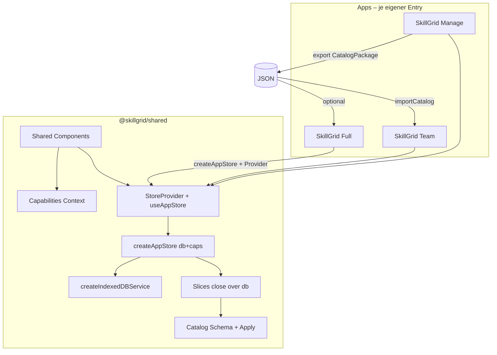
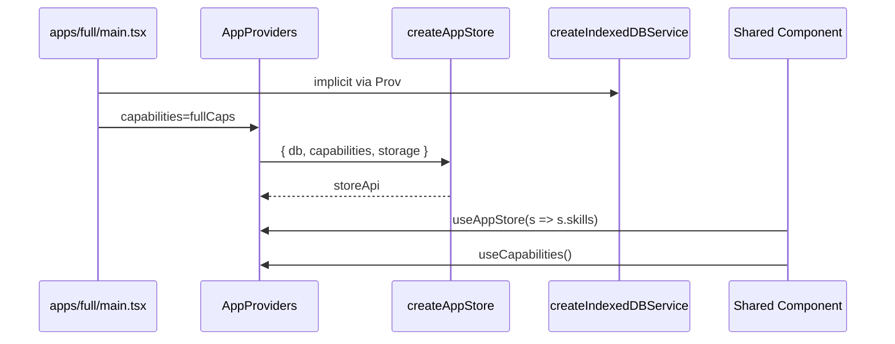
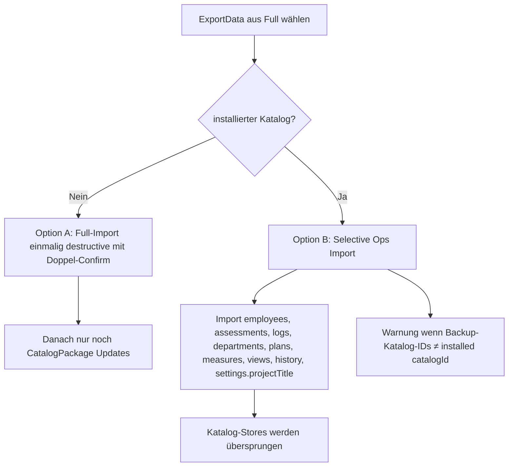
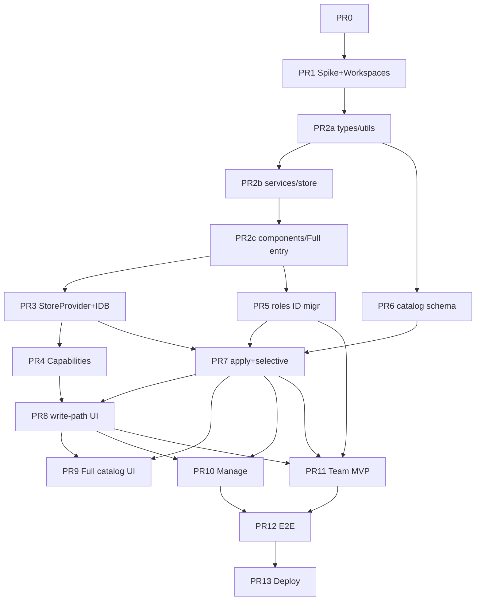

# Design: SkillGrid Monorepo – Full / Manage / Team

| Feld | Wert |
|------|------|
| **Dokument** | SkillGrid Product Split (Monorepo) |
| **Autor** | _TBD_ |
| **Datum** | 2026-08-07 |
| **Status** | Draft (Rev. 3 – Re-Review Schema/Apply/Authoring) |
| **Basis-Version** | SkillGrid `2.24.0` (`package.json`) |
| **Repo** | `/workspaces/qmatrix` |
| **Vorgeschlagener Branch** | `feature/monorepo-full-manage-team` |
| **Merge-Strategie** | Stacked PRs **früh nach `main`**, sobald PR 2c (Full grün aus shared) steht; langer Feature-Branch nur als optionaler Sammel-Zweig |

---

## Overview

SkillGrid ist heute eine einzelne Offline-First SPA (Vite + React 19 + TypeScript, Zustand, IndexedDB, PWA). Alle Domänen – Mitarbeiter, Matrix, Qualifizierung, Katalog-Stammdaten (Skills/Kategorien/Rollen) und System/Import-Export – leben in einer App mit einem **Modul-Singleton-Store** und einer Datenbank (`QualificationMatrixDB`).

Dieses Design spezifiziert die Aufteilung in **drei Apps in einem Monorepo**:

1. **SkillGrid Full** – funktional äquivalent zur heutigen App (v2.24.0); inkl. lokaler Katalog-Autorenschaft und optionalem Katalog-Import.
2. **SkillGrid Manage** – schlanke Admin-/Katalog-App: Source of Truth für Skills, Kategorien und Rollen mit **SemVer-Versionierung**, Changelog und Export versionierter Katalog-Pakete.
3. **SkillGrid Team** – Team-App mit Mitarbeitern, Matrix, Assessments, Qualifizierung und Dashboard; Katalog (Skills/Rollen/Kategorien) ist **read-only** und wird nur via Katalog-Import aktualisiert.

Gemeinsamer Code wandert in `packages/shared`. Jede App hat eigenen Vite-Entrypoint, Capability-Config, **eigene Store-Instanz** (kein globaler `useStore`-Singleton über Apps hinweg), IndexedDB-Namen (Full behält Legacy-DB-Namen) und Deploy-Origin.

---

## Background & Motivation

### Aktueller Stand (Codebase)

| Bereich | Ort / Fakten |
|---------|----------------|
| Single App | `package.json` name `skillgrid` @ `2.24.0` |
| Entry | `src/main.tsx` → `src/App.tsx` |
| Navigation | `NAV_ITEMS` in `App.tsx`: dashboard, matrix, qualification, data, system |
| Domain | `src/types/domain.ts` – Employee, Category, SubCategory, Skill, Assessment, Department, EmployeeRole, Qualification*, SavedView, ExportData, … |
| **Domain-Quirk** | `Employee.roles: string[]` speichert **Rollen-Namen**, nicht Role-IDs (im Gegensatz zu `Employee.department` nach name→id-Migration und zu `QualificationPlan.targetRoleId`) |
| Store | Zustand-Slices in `src/store/slices/*`; **`export const useStore = create(...)` Modul-Singleton**; alle Slices `import { db } from "../../services/indexeddb"` |
| Persistenz | `src/services/indexeddb.ts` – `DB_NAME = "QualificationMatrixDB"`, `DB_VERSION = 12`, **`export const db = new IndexedDBService()`** |
| Export | Flat `ExportData` (Full-Dump), kein Katalog-Format, keine Versionierung |
| Stammdaten-UI | `UnifiedDataView`: employees, departments, roles (`RoleManager`), skills (`CategoryManager`) |
| System | `DataManagement`: Backup JSON, merge/diff/applyMerge, PDF, Danger Zone |
| Größe | **93 TS/TSX-Dateien, ~25 176 LOC in `src/`** (nicht ~7k; frühere Zählung war unvollständig) |
| Tests | vitest unit, playwright e2e |
| UI-Sprache | Deutsch |

### Pain Points

1. **Keine Trennung von Katalog-Autorenschaft und Team-Betrieb.**
2. **Kein versionierter Katalog-Austausch** – `ExportData` mischt Ops- und Katalogdaten.
3. **ID-Stabilität vs. name-basierte Employee↔Role-Kopplung** – Rename bricht Assignments heute schon implizit.
4. **Globaler `db`/`useStore`-Singleton** – blockiert Multi-App-Isolation im shared Package.
5. **Deployment** = ein Artefakt; unterschiedliche Rollen teilen Origin und Storage.

### Warum Monorepo statt drei Repos

- ~25k LOC und hohe Überlappung → Duplikat teurer als Workspaces.
- Ein PR kann shared API + App-Adapter zusammen ändern.
- Gemeinsame Tests und Domain-Evolution.

---

## Goals & Non-Goals

### Goals

1. Drei lauffähige Apps (Full, Manage, Team) aus einem Monorepo mit klaren Capability-Grenzen.
2. Versioniertes **Catalog Package** als SoT von Manage → Team (und optional Full).
3. Full bleibt drop-in-kompatibel für bestehende Nutzer (Daten, Backup-Format, IndexedDB-Name).
4. Team kann Katalog-Updates anwenden, **ohne** Employees, Assessments, Qualifizierungspläne, Departments, Saved Views oder History zu löschen.
5. Stabile Entity-IDs über Katalog-Versionen; **Employee.roles auf Role-IDs migriert**, damit Rename sicher ist.
6. **MVP-Migrationspfad Full→Team** mit selektivem Import (nicht nur destructive full wipe).
7. Explizites Store-/DB-Wiring (Factory + Provider), kein shared Modul-Singleton.
8. Inkrementelle, reviewbare PR-Serie; Spike beweist singlefile+workspace-Build früh.

### Non-Goals

- Kein Backend, keine Multi-User-Sync-Cloud, kein Auth-Server.
- Kein Umschreiben des Kern-Domain-Modells (Skills an SubCategories, Rollen mit `requiredSkills`).
- Keine „Mode“-Umschaltung in einer Origin.
- Kein Turborepo/Nx in Phase 1.
- Keine automatische Live-Distribution von Katalogen (nur Datei-I/O).
- Departments **nicht** im Katalog-Paket.
- Kein Orphan-Cleanup-Wizard in Phase 1 (nur Report + Filter); Phase 2 optional.

---

## Key Decisions

| # | Entscheidung | Begründung |
|---|--------------|------------|
| K1 | Branch: `feature/monorepo-full-manage-team`; **Merge nach `main` sobald Full aus shared grün** (nach PR 2c), danach stacked PRs auf main | Reduziert Integration-Lag eines monatelangen Feature-Branches |
| K2 | **npm workspaces** (kein pnpm/Turborepo in Phase 1) | Bestehendes `package-lock.json`; 3 Apps + 1 Package |
| K3 | Layout: `apps/{full,manage,team}` + `packages/shared` | Standard; shared = Domain, Store-Factory, Services, shared UI |
| K4 | **Capability-Flags** pro App + React Context + Store-Guards (fail-soft in Prod) | UI und Mutations zentral steuern |
| K5 | Full = heutige App **plus** optionaler Katalog-Import; lokale Autorenschaft bleibt | Standalone-Nutzer behalten Autonomie |
| K6 | Manage = nur Katalog-Entities + Publish | Keine Employees/Assessments/Plans |
| K7 | Team = Full-Ops minus Katalog-Autorenschaft | Katalog read-only; Updates nur `importCatalog` |
| K8 | Neues Format `skillgrid-catalog` v1 | `ExportData` bleibt Full-Backup |
| K9 | Full behält `QualificationMatrixDB`; Manage/Team neue DB-Namen | Zero-data-loss für Full-Nutzer |
| K10 | **Drei getrennte Deploy-Origins (Netlify-Sites) sind Pflicht** | SW-Cache, localStorage und IDB-Origin-Isolation; path-based **abgelehnt** |
| K11 | Catalog apply soft-delete default; **niemals** `deleteSkill`/`deleteCategory` in soft mode | Vermeidet Assessment-Cascade aus heutigem `db.deleteSkill` |
| K12 | Shared als Workspace-Dep; Apps **aliasen auf `packages/shared/src`** (kein dist-Build von shared in Phase 1) | Weniger Tooling; TypeScript + Vite lösen Source |
| K13 | **Eine `catalogId` pro Manage-DB** | Einfachheit Phase 1 |
| K14 | Team: EmployeeDrawer **nur Select** bestehender Rollen, kein `addRole` | Ableitung aus `catalogAuthoring: false` |
| K15 | Full Katalog-Export = **Roh-Extrakt** (ohne SemVer-Publish-UX); Publish nur Manage | Klare SoT-Verantwortung |
| K16 | Orphans (Assessments/Measures an deprecated Skills): **behalten + Report**; UI filtert deprecated default hide; Cleanup-Wizard Phase 2 | Ops-Daten nie stillschweigend löschen |
| K17 | **`Employee.roles` → Role-IDs** (Load-Time-Migration analog Departments); dual-resolve während Übergang | Blocker für sichere Katalog-Renames |
| K18 | **`requiredSkills` auf Roles ist SoT**; `Skill.requiredByRoleIds` ist **abgeleiteter Index** (Export/Import und nach Role-Writes). **Authoring:** Skill-Formulare editieren **keine** Rollen-Mitgliedschaft (nur RoleManager schreibt Links + Levels). Skill-UI zeigt reverse Index read-only. | Verhindert stillen Datenverlust beim Katalog-Extrakt; heilt CategoryManager/SkillMatrix-Drift |
| K19 | Manage lehnt employee-schwere `ExportData` ab bzw. strippt Ops-Entities | Verhindert Manage-DB-Verschmutzung |
| K20 | Full re-import Katalog: Katalog-Entities by ID überschreiben; `catalogSource: "local"` nur bei missingPolicy keep/soft unangetastet wenn **nicht** in Package | Klare Mixed-Mode-Regel |
| K21 | App-Versionen **unabhängig** semvern (`full@2.x`, `manage@1.x`, `team@1.x`); shared unversioned workspace | Getrennte Release-Zyklen |
| K22 | **Selective Full→Team Import ist MVP** (nicht optional PR13) | Primärer Adoption-Pfad |
| K23 | IDB: **volles Object-Store-Schema in allen Apps** (gleiche Stores); Manage lässt Ops-Stores leer | Vermeidet divergente `onupgradeneeded`/importData-Pfade |
| K24 | Store: **Factory schließt über `db` + `capabilities`**; `StoreProvider` + `useAppStore()`; kein `export const db` in shared für Apps | Issue-1-Blocker |

---

## Feature-Matrix (User Stories × App)

| User Story | Full | Manage | Team |
|------------|:----:|:------:|:----:|
| Skills/Kategorien anlegen & editieren | ✓ | ✓ | ✗ (read-only Anzeige) |
| Rollen inkl. requiredSkills pflegen | ✓ | ✓ | ✗ (read-only) |
| Katalog versioniert publishen (SemVer+Changelog) | ✗ (nur Roh-Extrakt) | ✓ | ✗ |
| Katalog-Paket importieren/aktualisieren | ✓ optional | ✓ load-to-edit | ✓ primär |
| Mitarbeiter CRUD | ✓ | ✗ | ✓ |
| Abteilungen CRUD | ✓ | ✗ | ✓ |
| Skill-Matrix Assessments | ✓ | ✗ | ✓ |
| Qualifizierungspläne | ✓ | ✗ | ✓ |
| Dashboard / PDF-Reports | ✓ | ✗ | ✓ |
| Full-Backup ExportData | ✓ | Katalog-only Backup | ✓ |
| Full-Backup Import (destructiv) | ✓ | ✗ (reject/strip) | ✓ nur Migrations-Wizard |
| Selektiver Ops-Import (ohne Katalog) | optional | ✗ | ✓ MVP |
| Änderungshistorie Undo Katalog-Entities | ✓ | ✓ | ✗ (catalog mutations blocked; Import als atomic history entry) |
| Org-Charts (Role/Skill) | ✓ | ✓ (Skill/Role) | ✓ read-only Katalogteile |

---

## Proposed Design

### 1. Branch- & Merge-Strategie

```bash
git checkout main && git pull
git checkout -b feature/monorepo-full-manage-team
```

- PR 1–2c: auf Feature-Branch oder direkt stacked → `main`.
- **Ab PR 2c (Full build+test grün aus monorepo):** weitere PRs **gegen `main`** mergen, um Lag zu vermeiden (K1).
- Feature-Branch optional behalten für parallele Experimente; nicht als monatelanger Integrations-Silo.

### 2. Monorepo-Tooling

**npm workspaces** (K2).

```json
{
  "name": "skillgrid-monorepo",
  "private": true,
  "workspaces": ["packages/*", "apps/*"],
  "scripts": {
    "dev:full": "npm run dev -w @skillgrid/full",
    "dev:manage": "npm run dev -w @skillgrid/manage",
    "dev:team": "npm run dev -w @skillgrid/team",
    "build:full": "npm run build -w @skillgrid/full",
    "build:manage": "npm run build -w @skillgrid/manage",
    "build:team": "npm run build -w @skillgrid/team",
    "build": "npm run build:full && npm run build:manage && npm run build:team",
    "test": "npm run test -ws --if-present",
    "lint": "eslint ."
  }
}
```

**Hinweis:** Root `prebuild: vitest run` der heutigen Single-App wandert in die jeweiligen App-/shared-Scripts; Root baut nicht mehr „blind“ alles vor jedem Vite-Build, außer in CI.

| Option | Verdict |
|--------|---------|
| npm workspaces | **Gewählt** |
| pnpm | Später optional |
| Turborepo/Nx | Nicht Phase 1 |
| Multi-page Vite single package | Abgelehnt (PWA/Deploy) |
| Zwei Apps only (Manage+Full) / Team-as-mode | Abgelehnt – widerspricht Produkt (drei Oberflächen, getrennte Origins, Team ohne Autorenschaft) |

### 3. Package-Layout

```
/workspaces/qmatrix
├── package.json
├── packages/
│   └── shared/                    # @skillgrid/shared
│       ├── package.json           # "name": "@skillgrid/shared", "exports": { ".": "./src/index.ts", ... }
│       ├── tsconfig.json
│       └── src/
│           ├── index.ts           # public export surface
│           ├── types/
│           ├── constants/
│           ├── store/             # factory, provider, slices (db-injected)
│           ├── services/          # createIndexedDBService, catalog*, migrations, pdf
│           ├── utils/
│           ├── hooks/
│           ├── context/           # Privacy + Capabilities + Store
│           └── components/        # shared UI (Matrix, Managers, …)
├── apps/
│   ├── full/                      # @skillgrid/full – thin shell
│   ├── manage/                    # @skillgrid/manage
│   └── team/                      # @skillgrid/team
├── e2e/
└── scripts/
```

**Was gehört in shared vs. app-owned**

| In `@skillgrid/shared` | App-owned |
|------------------------|-----------|
| Domain, catalog types, capabilities types | `capabilities.ts` concrete config |
| IndexedDB factory, catalog apply, migrations | `main.tsx`, `index.html`, vite config |
| Store factory + slices + `StoreProvider` | App shell `App.tsx` (NAV, branding) |
| Matrix, CategoryManager, RoleManager, DataManagement (capability-aware) | App-specific copy/Welcome text |
| Utils, hooks, constants, pdfReport | public/ icons, PWA manifest names |

Manage **importiert** Matrix/Dashboard-Module nicht in seinem Bundle-Entry (tree-shaking / keine Imports in Manage `App.tsx`), auch wenn die Dateien in shared liegen.

**Shared package exports (Phase 1: Source-Alias, K12)**

```json
// packages/shared/package.json
{
  "name": "@skillgrid/shared",
  "private": true,
  "type": "module",
  "exports": {
    ".": "./src/index.ts",
    "./types": "./src/types/index.ts",
    "./store": "./src/store/index.ts",
    "./services": "./src/services/index.ts",
    "./components/*": "./src/components/*"
  },
  "peerDependencies": {
    "react": "^19.0.0",
    "react-dom": "^19.0.0",
    "@mantine/core": "^8.0.0",
    "zustand": "^5.0.0"
  }
}
```

Apps Vite:

```ts
resolve: {
  alias: {
    "@skillgrid/shared": path.resolve(__dirname, "../../packages/shared/src"),
  },
},
```

Kein separates `tsc`/`dist` für shared in Phase 1 (vermeidet Doppel-Build-Komplexität). Optional Phase 2: gebautes Package.

### 4. Architektur-Übersicht



### 5. Store-Wiring (kritisch – ersetzt Modul-Singleton)

#### 5.1 Ist-Zustand (Problem)

```
src/services/indexeddb.ts  →  export const db = new IndexedDBService()
src/store/slices/*.ts      →  import { db } from "../../services/indexeddb"
src/store/useStore.ts      →  export const useStore = create<AppState>()(...)
~40+ Komponenten          →  import { useStore } from ".../useStore"
```

Drei Apps können **nicht** denselben Modul-State und denselben `db`-Namen teilen, wenn shared gebündelt wird.

#### 5.2 Soll-Zustand

```typescript
// packages/shared/src/services/indexeddb.ts
export type DbService = /* interface of public methods */;
export function createIndexedDBService(options: {
  dbName: string;
  dbVersion?: number; // default 12 schema
}): DbService { /* class instance, no module singleton */ }

// packages/shared/src/store/createAppStore.ts
export function createAppStore(deps: {
  db: DbService;
  capabilities: AppCapabilities;
  storage: PrefixedStorage; // localStorage wrapper
}) {
  const { db, capabilities, storage } = deps;
  // Slices are factories: createHierarchySlice(db, capabilities)(set, get, api)
  return createStore<AppState>()((...a) => ({
    ...createCoreSlice(db, capabilities, storage)(...a),
    ...createHierarchySlice(db, capabilities)(...a),
    ...createOrgSlice(db, capabilities)(...a),
    // ...
    ...createCatalogSlice(db, capabilities)(...a),
    ...createDataMgmtSlice(db, capabilities)(...a),
    ...createHistorySlice(db, capabilities)(...a),
  }));
}

export type AppStoreApi = ReturnType<typeof createAppStore>;
```

**Wichtig:** Slices **importieren nicht** `db` oder `capabilities` aus Modul-Scope. Sie schließen darüber in der Factory. `recordChange.ts` erhält `db` als Argument (oder über `get()`-gebundene helper).

#### 5.3 React Binding

```typescript
// packages/shared/src/store/StoreProvider.tsx
const StoreContext = createContext<AppStoreApi | null>(null);
const CapsContext = createContext<AppCapabilities | null>(null);

export function AppProviders(props: {
  capabilities: AppCapabilities;
  children: React.ReactNode;
}) {
  const storeRef = useRef<AppStoreApi>();
  if (!storeRef.current) {
    const db = createIndexedDBService({
      dbName: props.capabilities.dbName,
      dbVersion: props.capabilities.dbVersion,
    });
    const storage = createPrefixedStorage(props.capabilities.localStoragePrefix);
    storeRef.current = createAppStore({ db, capabilities: props.capabilities, storage });
  }
  return (
    <CapsContext.Provider value={props.capabilities}>
      <StoreContext.Provider value={storeRef.current}>
        {props.children}
      </StoreContext.Provider>
    </CapsContext.Provider>
  );
}

/** Drop-in replacement for today's useStore */
export function useAppStore<T>(selector: (s: AppState) => T): T {
  const store = useContext(StoreContext);
  if (!store) throw new Error("useAppStore outside AppProviders");
  return useStore(store, selector); // zustand useStore(api, selector)
}

export function useCapabilities(): AppCapabilities {
  const c = useContext(CapsContext);
  if (!c) throw new Error("useCapabilities outside AppProviders");
  return c;
}
```

#### 5.4 Per-App re-export (Migrationshilfe)

```typescript
// apps/full/src/store.ts
export { useAppStore as useStore, useShallow, useCapabilities } from "@skillgrid/shared";
// während der Migration: Codemod ersetzt imports schrittweise
```

**Migrationsreihenfolge Call-Sites**

1. Factory + Provider in Full verdrahten; temporär `export const useStore = …` **pro App-Entry** (nicht in shared root), damit relative Imports in shared-Komponenten auf Context umgestellt werden.
2. Alle shared components: `import { useAppStore as useStore } from "../store/hooks"` (shared-interner Hook-Pfad).
3. Domain-Typen: nicht mehr aus `useStore` re-exporten; aus `@skillgrid/shared/types` (Breaking für relative imports – mitziehen in Extract-PRs).



### 6. Capability / Feature Flags

#### 6.1 Modell

```typescript
export type AppVariant = "full" | "manage" | "team";

export interface AppCapabilities {
  variant: AppVariant;
  displayName: string;

  dashboard: boolean;
  matrix: boolean;
  qualification: boolean;
  employees: boolean;
  departments: boolean;
  assessments: boolean;

  catalogAuthoring: boolean;
  catalogImport: boolean;
  catalogExport: boolean;       // raw extract and/or publish
  catalogVersioning: boolean;   // SemVer publish UI – Manage only

  fullBackupExport: boolean;
  fullBackupImport: boolean;    // destructive ExportData
  selectiveOpsImport: boolean;  // Team MVP
  pdfReports: boolean;

  /** Undo that would create/update/delete catalog entities */
  historyUndoCatalog: boolean;

  /** Show Stammdaten sub-tabs */
  stammdatenEmployees: boolean;
  stammdatenDepartments: boolean;
  stammdatenRoles: boolean;     // view; edit gated by catalogAuthoring
  stammdatenSkills: boolean;

  dbName: string;
  dbVersion: number;
  localStoragePrefix: string;
}
```

#### 6.2 Werte pro App

| Capability | Full | Manage | Team |
|------------|:----:|:------:|:----:|
| dashboard / matrix / qualification / assessments | ✓ | – | ✓ |
| employees / departments | ✓ | – | ✓ |
| catalogAuthoring | ✓ | ✓ | – |
| catalogImport | ✓ | ✓ (load) | ✓ |
| catalogExport | ✓ Roh | ✓ Publish | – |
| catalogVersioning | – | ✓ | – |
| fullBackupExport | ✓ | Katalog-only | ✓ |
| fullBackupImport | ✓ | – (reject) | Wizard only |
| selectiveOpsImport | – | – | ✓ |
| pdfReports | ✓ | – | ✓ |
| historyUndoCatalog | ✓ | ✓ | – |
| stammdaten* (roles/skills view) | ✓ | roles+skills only | ✓ read-only |
| dbName | `QualificationMatrixDB` | `SkillGridManageDB` | `SkillGridTeamDB` |
| localStoragePrefix | `skillgrid-full-` * | `skillgrid-manage-` | `skillgrid-team-` |

\* Full **liest** zusätzlich Legacy-Keys ohne Prefix (Migration, siehe §9).

#### 6.3 Navigation types

```typescript
/** Full / Team */
export type OpsAppTab = "dashboard" | "matrix" | "qualification" | "data" | "system";
/** Manage */
export type ManageAppTab = "skills" | "roles" | "system";
export type AppTab = OpsAppTab | ManageAppTab;
```

Manage-Shell mappt Tabs direkt (kein `UnifiedDataView` mit Employees).

#### 6.4 Guard-Verhalten

```typescript
/** Only boolean flags are valid guard keys — excludes dbName, displayName, etc. */
export type CapabilityFlag = {
  [K in keyof AppCapabilities]-?: AppCapabilities[K] extends boolean ? K : never;
}[keyof AppCapabilities];

export type GuardResult = { ok: true } | { ok: false; reason: string };

export function checkCapability(
  caps: AppCapabilities,
  key: CapabilityFlag,
  action: string
): GuardResult {
  if (caps[key]) return { ok: true };
  return { ok: false, reason: `[${caps.variant}] ${action} nicht erlaubt (${key})` };
}

/** Production UI paths: notify + no-op. Dev/tests: optional throw. */
export async function withCapability<T>(
  caps: AppCapabilities,
  key: CapabilityFlag,
  action: string,
  fn: () => Promise<T>
): Promise<T | undefined> {
  const r = checkCapability(caps, key, action);
  if (!r.ok) {
    if (import.meta.env.DEV) console.error(r.reason);
    return undefined;
  }
  return fn();
}
```

**`createEntityCrudHandlers` + capabilityKey (Pflicht für Katalog-Entities):**

| Entity listKey | `capabilityKey` | Pflicht? |
|----------------|-----------------|:--------:|
| `categories`, `subcategories`, `skills` | `"catalogAuthoring"` | **required** |
| `roles` | `"catalogAuthoring"` | **required** |
| `employees`, `qualificationPlans`, `qualificationMeasures`, `savedViews` | none / ops flags as needed | optional |
| `departments` | none (gated by UI `departments` flag only) | optional |

TypeScript: für hierarchy/org catalog handlers ist `capabilityKey: "catalogAuthoring"` **nicht optional** im Config-Typ (`HierarchyCrudConfig` / `RoleCrudConfig`). Ops-CRUD behält optionales Key. So können neue Katalog-CRUD-Pfade den Guard nicht „vergessen“.

### 7. Write-Path-Inventory (Capability Gating)

Vollständige Matrix der **katalog-mutierenden** Pfade. Ops-Pfade (Employee, Assessment, …) sind in Team erlaubt und hier nicht gelistet.

| # | Surface | Store / DB Action | Capability | Team-Verhalten |
|---|---------|-------------------|------------|----------------|
| W1 | `CategoryManager` CRUD + clipboard paste/copy | `add/update/deleteCategory|SubCategory|Skill` | `catalogAuthoring` | UI hidden; guard no-op |
| W2 | `RoleManager` CRUD + `updateSkillsForRole` | `add/update/deleteRole`, skill role links | `catalogAuthoring` | read-only Detail |
| W3 | `EntityFormDrawer` (CategoryManager) | skill name/desc/hierarchy only; **no** role-membership edit (K18) | `catalogAuthoring` | read-only |
| W4 | `SkillMatrix/index.tsx` add/edit/delete cat/sub/skill | hierarchy mutations | `catalogAuthoring` | no edit menus |
| W5 | `SkillMatrix` skill edit | **no** `requiredByRoleIds` write (K18); reverse index display only | `catalogAuthoring` | disabled |
| W6 | `QuickAddDrawer` | `addSkill` / `addCategory` | `catalogAuthoring` | not mounted / disabled |
| W7 | `EmployeeDrawer` creatable role | `addRole` | `catalogAuthoring` | MultiSelect data only, no creatable |
| W8 | `EmployeeDrawer` creatable department | `addDepartment` | `departments` (not catalog) | **allowed** in Team |
| W9 | `historySlice.undoChange` for category/sub/skill/role | db delete/update/add | `historyUndoCatalog` | Undo button disabled for those entityTypes; import-batch undo special-cased |
| W10 | `importData` (ExportData destructive) | all stores clear+write | `fullBackupImport` | only via Migration Wizard |
| W11 | `mergeData` / `applyMerge` | may write catalog stores | `fullBackupImport` **and** if catalog stores selected: `catalogAuthoring` \|\| confirm | Team: merge UI **filters out** categories/subcategories/skills/roles by default |
| W12 | `importCatalog` | catalog stores upsert | `catalogImport` | primary path |
| W13 | `exportCatalog` / publish | read + file download | `catalogExport` | n/a |
| W14 | `clearAllData` | all stores | always confirm | allowed (danger) |

**PR-Abdeckung:**

| PRs | Surfaces |
|-----|----------|
| **PR 8** (write-path UI) | W1–W9: CategoryManager, RoleManager, SkillMatrix, QuickAdd, EmployeeDrawer role create, History undo UI, K18 skill-form read-only reverse index |
| **PR 7** (API) | W12 `importCatalog` / apply; selective ops import API |
| **PR 4** | Guard types + `capabilityKey` required on hierarchy/role CRUD |
| **PR 9** (Full DataManagement) | W10–W11 Full paths; W13 raw extract |
| **PR 11** (Team Wizard) | W10–W11 Team rails; W12 primary UX |

### 8. Versionierter Katalog (Source of Truth)

#### 8.1 Entities im Paket

| Entity | Im Katalog? |
|--------|:-----------:|
| Category, SubCategory, Skill, EmployeeRole | ✓ |
| Department, Employee, Assessment, Plans, Views, History | ✗ |

- Skill.`departmentId`: beim **Export strippen**; beim **Apply** Feld nicht schreiben (lokaler Wert in Full/Team bleibt, falls gesetzt).
- Alle Katalog-Entities im Package: **`id: string` Pflicht** (UUID); `id?` nur im live Domain-Typ für Drafts.

#### 8.2 Schema

```typescript
export type SemVer = string; // validated

export interface CatalogChangelogEntry {
  version: SemVer;
  date: string; // YYYY-MM-DD
  notes: string;
}

export interface CatalogMeta {
  catalogId: string;       // stable UUID for product line
  name: string;
  version: SemVer;
  publishedAt: string;     // ISO-8601
  publisher?: string;
  changelog: CatalogChangelogEntry[];
  minAppFormatVersion: number; // apply rejects if app formatVersion < this
  /**
   * If true: empty entity arrays mean "kind not included" (no-op for that kind).
   * If false or omitted: package is a full snapshot; empty array applies missingPolicy
   * to all catalog-sourced locals of that kind.
   * Manage Publish always sets partial: false.
   */
  partial?: boolean;
}

/** Export/import types – ids required */
export interface CatalogCategory extends Category { id: string }
export interface CatalogSubCategory extends SubCategory { id: string }
export interface CatalogSkill extends Omit<Skill, "departmentId" | "requiredByRoleIds"> {
  id: string;
  // requiredByRoleIds omitted in file; re-derived on import
}
export interface CatalogRole extends EmployeeRole { id: string }

export interface CatalogEntities {
  categories: CatalogCategory[];
  subcategories: CatalogSubCategory[];
  skills: CatalogSkill[];
  roles: CatalogRole[];
}

export interface CatalogPackage {
  format: "skillgrid-catalog";
  formatVersion: 1;
  meta: CatalogMeta;
  entities: CatalogEntities;
  /** SHA-256 hex of canonical entities JSON – corruption detection, NOT authentication */
  contentHash?: string;
}
```

Dateiname: `{safeName}_Katalog_v{version}_{YYYY-MM-DD}.json`

#### 8.3 SemVer-Regeln (korrigiert)

| Bump | Trigger |
|------|---------|
| **MAJOR** | Hard-remove von Entity-IDs aus dem Paket (wenn Manage hard delete published); `formatVersion` Erhöhung; Entfernen/Umbenennen von Pflichtfeldern im Schema |
| **MINOR** | Neue Entities; Rename **bei stabiler ID**; Level-Änderungen in `requiredSkills`; Hierarchie-Verschiebungen; neue optionale Felder |
| **PATCH** | Typos in name/description; Icon-only; Changelog-Text |

- **Name-Rename ist MINOR** (ID stabil). Nach K17 (roles-by-ID) bricht das keine Employee-Assignments.
- Bis ID-Migration fertig: Apply **rewrited** zusätzlich name-Strings auf Employees (Übergangsregel).

#### 8.4 requiredSkills als SoT (K18) – Export, Apply **und** Authoring

**Authoring-Regel (Preferred – verhindert Export-Datenverlust)**

| UI | Erlaubt |
|----|---------|
| **RoleManager** | Schreibt `role.requiredSkills[{ skillId, level }]` und ruft danach `recomputeRequiredByRoleIds()` auf (abgeleiteter Index auf Skills) |
| **CategoryManager / EntityFormDrawer / SkillMatrix skill edit** | Editieren Name, Description, Hierarchie, ggf. `departmentId` (Full). **Keine** MultiSelect/Editor für Rollen-Mitgliedschaft. Anzeige: read-only Liste „Gefordert von Rollen: …“ aus reverse Index |
| **`updateSkillsForRole` / skill save paths** | Dürfen `requiredByRoleIds` nicht als führende Quelle setzen; nach Role-Write immer aus `requiredSkills` ableiten |

Migration UI (PR 8): bestehende Skill-Form-Felder für `requiredByRoleIds` entfernen oder disabled + Hinweis „Rollen-Zuordnung unter Stammdaten → Rollen bearbeiten“.

**Export-Algorithmus**

1. Serialize categories, subcategories, roles **as stored** (`role.requiredSkills` inkl. Levels).
2. For each skill: omit `departmentId` and `requiredByRoleIds`.
3. Validate every `role.requiredSkills[].skillId` ∈ skill ids.
4. **Pre-export consistency check (Full Roh-Extrakt):**  
   `orphanSkillRoleLinks = skills whose requiredByRoleIds contain roleId not reflected in any role.requiredSkills`.  
   If non-empty: extract report **warning** (should be empty after K18 authoring; still warn on legacy data).  
   **Do not** invent levels from skill-only links into roles on export (would fabricate SoT). Authors must fix via RoleManager before publish; Manage Publish blocks on orphan links (error), Full raw extract only warns.

**Import/Apply – abgeleiteter Index**

```
requiredByRoleIds(skill) := { role.id | role.requiredSkills contains skill.id }
```

Overwrite `skill.requiredByRoleIds` completely from roles after role upsert. Ignore residual local drift.

#### 8.5 Apply-Semantik

```typescript
interface CatalogApplyOptions {
  upsert: boolean; // default true
  missingPolicy: "soft" | "hard" | "keep"; // default soft
}

interface CatalogApplyReport {
  added: Record<CatalogEntityKind, number>;
  updated: Record<CatalogEntityKind, number>;
  deprecated: Record<CatalogEntityKind, number>; // soft
  hardRemoved: Record<CatalogEntityKind, number>;
  roleNameRewrites: number; // transitional employee.roles string fixes
  orphanAssessments: number; // assessments whose skill is deprecated/missing
  orphanMeasures: number;
  hierarchyWarnings: number; // I10 parent/child inconsistency
  warnings: string[];
  previousVersion?: SemVer;
  newVersion: SemVer;
}
```

**Apply-Pipeline (verbindliche Reihenfolge)**

| Step | Aktion |
|------|--------|
| 0 | `validateCatalogPackage` (format, formatVersion, minAppFormatVersion, SemVer, UUID ids, FK refs within package, `inheritsFromId` acyclic, `requiredSkills.skillId` ∈ skills). Normalize `meta.partial = meta.partial === true` (default **false**). |
| 1 | Begin IDB transaction: categories, subcategories, skills, roles, settings (+ employees only if name-rewrite bridge). |
| 2 | **Upsert categories** (by id). Clear `catalogDeprecated` on hit; set `catalogSource: "catalog"`. |
| 3 | **Upsert subcategories** (by id). Parent `categoryId` must exist in package or already in DB after step 2. |
| 4 | **Upsert skills** (by id) **without** writing `requiredByRoleIds` / without `departmentId` from package. |
| 5 | **Upsert roles** (by id). Write `requiredSkills` as in package. **`inheritsFromId`:** two-pass — (5a) put all roles with fields except resolve order; (5b) ensure every `inheritsFromId` references an id present after 5a (package ∪ kept local). If package array order is child-before-parent, still OK because upsert is by id not insert-only. Reject cycles detected in step 0. |
| 6 | **Re-derive** `requiredByRoleIds` on all skills from all roles (package-applied + remaining local roles if keep/soft left extras — prefer recompute from **all roles currently in DB after step 5**). |
| 7 | **missingPolicy pass** per entity kind (respect `meta.partial` — see I5). |
| 8 | **I10 hierarchy consistency pass** (see below). |
| 9 | Update `settings.installedCatalogMeta`; write changeHistory `entityType: "catalog"`; optional employee role-name rewrite bridge. |
| 10 | Commit transaction; compute report (orphans, hierarchyWarnings). |

**Invarianten**

| # | Invariant |
|---|-----------|
| I1 | Soft/keep: **never** call `deleteSkill` / `deleteCategory` / `deleteSubCategory` / `deleteRole` |
| I2 | Soft: missing package entities → set `catalogDeprecated: true`, keep row |
| I3 | Hard: only after explicit confirm; still **does not** cascade-delete assessments in catalog apply path – use dedicated `hardRemoveCatalogEntity` that **only** deletes catalog row (document that assessments become orphaned; count in report). **Do not reuse** `db.deleteSkill` (which deletes assessments today). |
| I4 | Never touch employees, assessments, logs, plans, measures, departments, savedViews, changeHistory rows (except optional role-name rewrite on employees, and settings.catalog meta) |
| I5 | **`meta.partial` (on `CatalogMeta`, default `false`):** · `partial === true`: empty `entities.<kind>[]` = kind **not included** → **no-op** for that kind (do not deprecate/remove locals). Non-empty arrays still upsert those ids; missingPolicy only for ids previously catalog-sourced that were in a **previous full** install is **not** applied for omitted kinds. · `partial === false` or **absent**: full snapshot; empty array for a kind applies missingPolicy to **all** local catalog-sourced entities of that kind. Manage Publish **always** sets `partial: false`. validateCatalogPackage: if `partial` is not boolean when present → reject; unit tests cover empty-array × partial true/false × soft/hard/keep. |
| I6 | `minAppFormatVersion > app format support` → reject before write |
| I7 | Version downgrade → reject unless confirm |
| I8 | Different `catalogId` → strong confirm |
| I9 | Transaction: single IDB transaction over catalog stores + settings (pipeline steps 1–9) |
| I10 | **Hierarchy consistency (after upsert + missingPolicy):** · If a **child** (subcategory/skill) is in the package and active (`catalogDeprecated` false) but its parent category/subcategory is deprecated or missing: **re-activate parent path** if parent still exists in DB (clear `catalogDeprecated` on ancestors); if parent id missing entirely, add `warnings` + count `hierarchyWarnings` (orphan child kept, UI may hide via ancestor rule). · If a **parent** is soft-deprecated (absent from full package) and children are **not** in the package: deprecate catalog-sourced descendants (cascade deprecate down). · If parent deprecated but child **is** in package: child upsert wins → re-activate ancestors (first bullet). · Hard-remove parent: only via I3 per entity; do not cascade hard-delete children automatically—either children listed for hard remove or left orphaned with warning. |

**UI-Filter deprecated (K16) + I10**

| View | Default |
|------|---------|
| Matrix rows/columns | Hide skill if skill **or any ancestor** (subcategory chain / category) is `catalogDeprecated` (toggle „Veraltet anzeigen“) |
| Dashboard aggregates | Exclude skills hidden by ancestor rule |
| Qualification gap analysis | Exclude deprecated lineage; warn if measure references hidden skill |
| Stammdaten Roles/Skills (Team) | Show deprecated with Badge „Veraltet“; greyed |
| Role.requiredSkills | Keep IDs as in package; local deprecated skills still listed if role still references |

**Full mixed mode (K20)**

- Entities from package → upsert, `catalogSource: "catalog"`, clear `catalogDeprecated` if present again.
- Local-only (`catalogSource: "local"` or missing source pre-migration):  
  - soft/keep: not removed when absent from package  
  - hard: only removed if user confirms „lokale Katalog-Einträge löschen“
- If local entity **same id** as package: package wins (re-import after local edit of catalog entity is expected overwrite).
- Same **name** different **id**: no auto-merge; both exist (user must clean).

#### 8.6 Employee.roles – ID-Migration (K17)

**Heute:** `Employee.roles` = name strings (`EmployeeDrawer` MultiSelect `data={roles.map(r => r.name)}`, Filter `emp.roles.includes(filterRole)` name, `RoleOrgChart` `emp.roles?.includes(role.name)`).

**Ziel:** `Employee.roles: string[]` of **role UUIDs**.

**Load-time migration** (in `dataMigrations.ts`, analog department):

```
for emp in employees:
  emp.roles = emp.roles.map(token => {
    if (roles.some(r => r.id === token)) return token;
    const byName = roles.find(r => r.name === token);
    return byName?.id ?? token; // leave unresolved for badge
  })
```

**Dual-resolve** (Übergang, wie `skillCalculations`/`skillGaps` schon name|id können):  
`resolveRole(token, roles) := by id || by name`.

**Catalog apply rename bridge** (solange noch name-tokens existieren):  
When role id matches and name changes: `employees.forEach` replace oldName with newName **or** prefer migrate to id first in same PR.

**Badge „Rolle fehlt“:** token resolves to neither id nor name → Badge in EmployeeList/Matrix header.

**Tests:** rename role → assessments + employee assignment still valid; gap analysis still works.

#### 8.7 Kompatibilität ExportData

- Unchanged shape for backups.
- Optional additive `catalogMeta?: CatalogMeta` on ExportData.
- `extractCatalogFromExport(data, metaPartial) → CatalogPackage`.
- Manage `fullBackupImport: false`: if user drops ExportData, UI offers „Katalog extrahieren“ only (K19).

#### 8.8 Size / Perf

- Stress-fixture: `stress-test-data.json` im Repo als Basis für Extract+Apply Benchmarks.
- Guidance: Kataloge &lt; ~5 MB JSON typisch; Warnung ab 10 MB; Apply O(n) upserts in one transaction – target &lt; 3 s für 2k skills auf Mittelklasse-Hardware.
- contentHash: optional; **Korruptionserkennung**, keine Authentizität (offline, K15 security).

#### 8.9 changeHistory & dataHash

- `EntityType` erweitern: `| "catalog"`.
- Ein Catalog-Import schreibt **einen** History-Entry:  
  `{ entityType: "catalog", entityId: catalogId, entityLabel: "Katalog vX.Y.Z", action: "update", previousData: oldMeta, newData: { meta, reportSummary } }`.
- Team: `historyUndoCatalog: false` → Undo dieses Entry zeigt Hinweis „Katalog-Import nicht per Undo rückgängig – vorheriges Katalog-Paket erneut importieren“.
- `getDataHash()` hasht weiterhin full `exportData()` (inkl. Katalog-Entities). Nach catalog-only apply ändert sich Hash – korrekt (settings + catalog fields). Kein separater Catalog-Hash nötig außer Package `contentHash`.

### 9. IndexedDB- & localStorage-Isolation

#### 9.1 IndexedDB

| App | DB_NAME |
|-----|---------|
| Full | `QualificationMatrixDB` |
| Manage | `SkillGridManageDB` |
| Team | `SkillGridTeamDB` |

**Schema (K23):** Alle Apps öffnen **dieselben Object Stores** (employees, categories, …, changeHistory) wie DB_VERSION 12. Manage schreibt nur categories/subcategories/skills/roles/settings/changeHistory; Ops-Stores bleiben leer. Vorteil: ein `onupgradeneeded`, ein import/export-Codepfad.

#### 9.2 localStorage – vollständiges Inventory

| Key (heute) | Nutzung | Full nach Split | Manage/Team |
|-------------|---------|-----------------|-------------|
| `skillgrid-active-tab` | App tab | Legacy read + write `skillgrid-full-active-tab` | `{prefix}active-tab` |
| `skillgrid-sidebar-opened` / `sidebar-opened` | Navbar | Full: keep legacy | prefixed |
| `skillgrid-color-scheme` (+ qtrack migr) | Theme | Full legacy | prefixed |
| `skillgrid-anonymous-mode` | Privacy | Full legacy | prefixed |
| `skillgrid-dashboard-tiles` | Dashboard | Full legacy | prefixed |
| `skillgrid-has-unsaved-changes` | coreSlice | Full legacy | prefixed |
| `skillgrid-welcome-seen-v1` | WelcomeModal | Full legacy | prefixed per app |
| `unified-data-tab` | UnifiedDataView | → prefixed | prefixed |
| `qualification-plan-tab` | Qual UI | → prefixed | prefixed |
| `last_data_action` | DataManagement | → prefixed | prefixed |
| `skill-matrix-filter-departments` | useMatrixState | → prefixed | prefixed |
| `skill-matrix-filter-roles` | | | |
| `skill-matrix-filter-categories` | | | |
| `skill-matrix-filter-employees` | | | |
| `skill-matrix-filter-levels` | | | |
| `skill-matrix-filter-skills` | | | |
| `skill-matrix-metric-mode` | | | |
| `skill-matrix-sort-employee` | | | |
| `skill-matrix-sort-skill` | | | |
| `skill-matrix-grouping-mode` | | | |
| `skill-matrix-hide-employees` | | | |
| `skill-matrix-hide-na-columns` | | | |
| `skill-matrix-show-inactive` | | | |
| `skill-matrix-show-only-gaps` | | | |
| `skill-matrix-active-view-id` | | | |

Implementierung: `createPrefixedStorage(prefix)` mit `getItem/setItem`; Full-Prefix-Helper liest Legacy-Key falls prefixed missing (einmalige Migration).

**Isolation:** DB-Namen isolieren nur IDB-Daten. **localStorage + Service Worker + Cache API teilen den Origin.** Deshalb ist K10 (drei Origins) **Pflicht**, nicht „nice to have“. Path-based Deploy (Alternative B) ist **rejected** primär wegen SW/localStorage-Kollisionen.

### 10. Full vs Manage vs Team – Produktregeln

| Thema | Regel |
|-------|--------|
| Full Export Katalog | Roh-Extrakt ohne Publish-Dialog (K15) |
| Manage Publish | SemVer + Changelog Pflicht |
| Manage Import ExportData | Reject oder extract-catalog-only (K19) |
| Full dual-mode | K20 |
| Team Stammdaten | Tabs: Mitarbeiter, Abteilungen, Rollen (ro), Skills (ro); System: Katalog-Import + Backup |
| Team Empty Matrix | CTA „Katalog importieren“ wenn `skills.length === 0` |

### 11. Manage App Shell (IA)

```
Navbar:
  - Skills & Kategorien  (CategoryManager, authoring on)
  - Rollen & Level       (RoleManager + RoleOrgChart / SkillOrgChart optional)
  - System               (Publish Katalog, Changelog, Katalog laden, Katalog-Backup, Danger reset)

Header: "SkillGrid Manage" + catalog name + version badge
Kein: Dashboard, Matrix, Qualifizierung, Mitarbeiter, Abteilungen, PDF
```

### 12. Team Migration Full→Team (MVP, K22)

**Ordered Wizard (System → „Von Full migrieren“)**



**Selective import API (MVP mit Team)**

```typescript
importOpsFromExportData(data: ExportData, opts: {
  include: Array<
    | "employees" | "assessments" | "history" | "departments"
    | "qualificationPlans" | "qualificationMeasures" | "savedViews"
    | "changeHistory" | "settings"
  >;
  mode: "merge" | "replace-ops"; // replace-ops clears only listed ops stores
}): Promise<MergeReport>;
```

Default Team migration: `replace-ops` for ops stores, **never** clear catalog stores if `installedCatalogMeta` set.

Destructive full import remains available behind „Alles ersetzen (inkl. Katalog)“ with two confirms – for empty Team bootstrapping from one Full backup in one step, then user should re-publish catalog from Manage using extract for future updates.

### 13. Build & Deploy

- Drei Vite-Apps, singlefile+PWA jeweils.
- **Spike in PR 1:** `packages/shared` dummy module + Full build with alias + singlefile+PWA must succeed.
- Netlify: drei Sites, monorepo root build, publish `apps/*/dist`.
- Branding: Full blue / Manage violet / Team cyan; PrivacyModal text nennt App-DisplayName.

**E2E ports**

| App | dev port | playwright baseURL |
|-----|----------|-------------------|
| full | 5173 | http://localhost:5173 |
| manage | 5174 | http://localhost:5174 |
| team | 5175 | http://localhost:5175 |

```ts
// playwright.config.ts sketch
projects: [
  { name: "full", use: { baseURL: "http://localhost:5173" }, testMatch: /full\/.*\.spec\.ts/ },
  { name: "manage", use: { baseURL: "http://localhost:5174" }, testMatch: /manage\/.*\.spec\.ts/ },
  { name: "team", use: { baseURL: "http://localhost:5175" }, testMatch: /team\/.*\.spec\.ts/ },
]
```

### 14. Risiken

| Risiko | Severity | Mitigation |
|--------|----------|------------|
| Store-Singleton-Extract bricht Imports | Critical | PR 3 dediziert Provider; Codemod; Full green gate |
| Employee.roles by name + catalog rename | Critical | K17 migration before Team catalog GA |
| Guard throws mid-UI | High | fail-soft + write-path matrix |
| `deleteSkill` assessment cascade | High | apply never uses deleteSkill in soft mode; hard path dedicated |
| PR extract too large (~25k LOC) | High | staged 2a/2b/2c |
| singlefile + workspace alias | High | Spike PR 1 |
| SW/localStorage same origin | High | three origins required |
| Destructive Team import wipes catalog | High | selective MVP + wizard rails |
| Dual requiredSkills / requiredByRoleIds drift | Medium | **K18 authoring:** only RoleManager writes links; skill UI read-only reverse index; export omits skill-side links; Manage publish blocks orphan skill→role links |
| Large catalog perf | Medium | stress-test fixture |

---

## API / Interface Changes

### Neu

```typescript
createIndexedDBService(opts): DbService
createAppStore({ db, capabilities, storage }): AppStoreApi
AppProviders, useAppStore, useCapabilities
createPrefixedStorage(prefix)
validateCatalogPackage(data): asserts CatalogPackage
extractCatalogFromExport(data, meta): CatalogPackage
applyCatalogToDb(db, pkg, options): Promise<CatalogApplyReport>
importOpsFromExportData(db, data, opts): Promise<MergeReport>
compareSemVer / suggestBump(diff)
CapabilityFlag; checkCapability / withCapability (boolean flags only)
```

### Geändert

- Slices: `(db, caps) => StateCreator` statt hard-import `db`.
- `EntityType` += `"catalog"`.
- `AppSettings` += `installedCatalogMeta?: CatalogMeta`.
- Domain optional: `catalogSource?`, `catalogDeprecated?`.
- Components: `readOnly` / capabilities; skill forms drop role-membership edit (K18).
- Navigation types split Manage vs Ops.
- `createEntityCrudHandlers`: `capabilityKey: "catalogAuthoring"` **required** for category/subcategory/skill/role.

### Unverändert

- `ExportData` core fields (additive OK).
- SkillLevel scale; assessment id `${employeeId}-${skillId}`.

---

## Data Model Changes

```typescript
// additive on catalog entities
catalogSource?: "local" | "catalog";
catalogDeprecated?: boolean;

// Employee.roles semantic change (breaking for raw JSON meaning)
// Before: role names; After: role ids (migration on load)
roles?: string[];

// AppSettings
installedCatalogMeta?: CatalogMeta;
```

DB_VERSION: bump when adding indexes if needed; flags need no index. Full stays compatible with v12 stores.

---

## Alternatives Considered

1. **Eine App, Runtime-Modus** – verworfen (Origin/PWA/UX).
2. **pnpm + Turborepo Tag 1** – verschoben.
3. **Katalog = gefiltertes ExportData** – verworfen.
4. **ID-Remap by name on import** – verworfen (zerstört Assessments).
5. **Shared nur Types** – verworfen.
6. **Nur Manage + Full (kein Team)** – verworfen: Team-Read-only-Ops ist explizites Produktziel; Full dual-mode ersetzt das nicht für getrennte Nutzergruppen.
7. **Team als Mode in Full** – verworfen: Capability-Bypass-Risiko, ein Origin, ein DB-Name-Konflikt mit „nur Team“.

---

## Security & Privacy

- Offline; keine Server-Auth.
- `contentHash` = **Bitrot/Korruptionserkennung**, keine Signatur/Auth.
- Catalog JSON size warning.
- dompurify für Rollen-HTML bleibt.
- PrivacyModal: App-`displayName`; Hinweis dass Daten nur in diesem Browser-Origin liegen (pro App-Site).

---

## Observability

- CatalogApplyReport Modal (wie Merge).
- History entry type `catalog`.
- Version badges: App + installed catalog (Team/Full).
- Keine Telemetrie default.

---

## Rollout Plan

1. Main bleibt Full-URL; Manage/Team Beta-Origins.
2. Pilot: ein Katalog Manage→Team.
3. GA: README Product Family; independent versions (K21).
4. Rollback: v2.24.0 tag; Full DB name preserved.

---

## Open Questions

1. ~~Full catalog export UX~~ → **K15**.
2. ~~Orphan assessments~~ → **K16**.
3. Departments im Katalog später? – bleibt nein Phase 1.
4. ~~Multi catalogId~~ → **K13**.
5. Finale Netlify-Hostnames? – **ops**, blockt Code nicht.
6. Singlefile CI-Artefakte für alle drei? – **ja** analog heute Full.
7. ~~EmployeeDrawer Team~~ → **K14**.
8. Soll Full nach ID-Migration von Employee.roles ExportData aus 2.24 noch importieren können? – **ja**, Load-Migration fängt names ab.

---

## References

- `package.json` – 2.24.0  
- `src/types/domain.ts` – ExportData; Employee.roles  
- `src/services/indexeddb.ts` – singleton `db`, deleteSkill cascade, getDataHash  
- `src/store/useStore.ts` – module singleton  
- `src/store/slices/*`, `recordChange.ts`  
- `src/App.tsx` – NAV, qtrack→skillgrid localStorage migr  
- `src/hooks/useMatrixState.ts` – unprefixed skill-matrix-* keys  
- `src/components/shared/EmployeeDrawer.tsx` – roles as names  
- `src/services/dataMigrations.ts` – department name→id precedent  
- `stress-test-data.json` – large fixture  
- Live: https://skill-grid.netlify.app/

---

## Appendix A – Shared public export surface

```typescript
// packages/shared/src/index.ts (conceptual)
export * from "./types";
export * from "./types/capabilities";
export * from "./types/catalog";
export { createIndexedDBService } from "./services/indexeddb";
export { createAppStore, AppProviders, useAppStore, useCapabilities, useShallow } from "./store";
export { validateCatalogPackage, extractCatalogFromExport, applyCatalogToDb, importOpsFromExportData } from "./services/catalog";
// components exported via deep paths or barrel as needed
```

## Appendix B – Soft-delete vs hard cascade (reference)

| Operation today | Effect on assessments |
|-----------------|----------------------|
| `db.deleteSkill` | **Deletes all assessments** for skill |
| hierarchy prepareDelete skill/category | Removes assessments from React state + DB cascade |
| Catalog apply soft | **Must not** call above; sets `catalogDeprecated` |
| Catalog apply hard | Delete catalog row only via new method; assessments remain; report orphans |

---

## PR Plan

### Merge-Strategie

Nach **PR 2c** grün: PRs gegen `main`. Davor optional Feature-Branch.

### PR 0 – Branch & Design

| | |
|--|--|
| **Titel** | `chore: branch + monorepo design baseline` |
| **Dateien** | Branch only / optional ADR |
| **Deps** | – |
| **Beschreibung** | Branch anlegen; Review abschließen. |

### PR 1 – Workspaces + Spike Build

| | |
|--|--|
| **Titel** | `chore(monorepo): npm workspaces, apps/full shell, shared spike, singlefile proof` |
| **Dateien** | Root `package.json` workspaces; `packages/shared` minimal export (dummy); `apps/full/{package.json,index.html,vite.config.ts,src/main.tsx}`; CI `build:full` |
| **Deps** | PR 0 |
| **Beschreibung** | **Festgelegt (kein Oder):** Root-`src/` bleibt **kanonisch** bis PR 2a. `apps/full` Vite `root` bzw. Alias zeigt auf Repo-`src/` **plus** einen Import aus `@skillgrid/shared` (Spike-Dummy). **Kein Symlink**, kein Copy des Baums, **kein** Move in PR 1. Spike muss beweisen: `npm run build -w @skillgrid/full` mit singlefile + PWA grün. |

### PR 2a – Extract types + utils + constants

| | |
|--|--|
| **Titel** | `refactor(shared): types, constants, utils nach @skillgrid/shared` |
| **Dateien** | `packages/shared/src/types|constants|utils`, App imports |
| **Deps** | PR 1 |
| **Beschreibung** | Full muss grün bleiben. Keine Store-Änderung. |

### PR 2b – Extract services + store (noch Singleton)

| | |
|--|--|
| **Titel** | `refactor(shared): services + store slices nach shared (singleton vorerst)` |
| **Dateien** | indexeddb, migrations, pdf, store/* |
| **Deps** | PR 2a |
| **Beschreibung** | Pfade anpassen; `export const db` + `useStore` bleiben vorübergehend in shared (ein App). Full green. |

### PR 2c – Extract components + Full shell only in apps/full

| | |
|--|--|
| **Titel** | `refactor(shared): components + hooks; apps/full ist einziger App-Entry` |
| **Dateien** | components/*, hooks/*, context/*; remove root src app entry |
| **Deps** | PR 2b |
| **Beschreibung** | Full build+unit+e2e grün. **Gate für main-merge.** |

### PR 3 – IDB factory + StoreProvider + slice injection

| | |
|--|--|
| **Titel** | `refactor(store): createIndexedDBService, createAppStore, AppProviders, useAppStore` |
| **Dateien** | indexeddb factory; all slices take `db`; remove module `export const db` usage; StoreProvider; Full main wraps providers; localStorage prefix helper (Full legacy keys) |
| **Deps** | PR 2c |
| **Beschreibung** | Issue-1-Fix. Full behavior identical; dbName still QualificationMatrixDB. |

### PR 4 – Capabilities + guards + navigation types

| | |
|--|--|
| **Titel** | `feat: AppCapabilities, fail-soft guards, Manage/Ops AppTab types` |
| **Dateien** | capabilities.ts, createEntityCrud capabilityKey, Full caps all-on, historyUndo flags |
| **Deps** | PR 3 |
| **Beschreibung** | Full identical UX. Unit tests guards. |

### PR 5 – Employee.roles → ID migration

| | |
|--|--|
| **Titel** | `feat(domain): Employee.roles store role IDs; load migration; dual-resolve` |
| **Dateien** | dataMigrations, EmployeeDrawer, filters, MatrixHeader, RoleOrgChart, Dashboard, skillGaps tests |
| **Deps** | PR 4 (or 2c+; can parallel after 2c if careful) |
| **Beschreibung** | K17. Prerequisite for safe catalog rename. ExportData from 2.24 still imports (names migrated on load). |

### PR 6 – CatalogPackage schema + validate + extract

| | |
|--|--|
| **Titel** | `feat(catalog): format v1, validation, extractCatalogFromExport, contentHash` |
| **Dateien** | types/catalog.ts (`CatalogMeta.partial`), services/catalog.ts, tests (+ stress extract, empty×partial matrix) |
| **Deps** | PR 2a (types); ideally PR 5 for docs consistency |
| **Beschreibung** | Pure functions; required ids; `partial` default false; requiredSkills SoT export; orphan skill-link warnings; minAppFormatVersion. |

### PR 7 – catalogSlice apply + selective ops import API

| | |
|--|--|
| **Titel** | `feat(catalog): applyCatalog soft/hard/keep + importOpsFromExportData` |
| **Dateien** | catalogSlice, apply pipeline steps 0–10, I10 hierarchy pass, indexeddb helpers (no deleteSkill on soft), settings meta, EntityType catalog, report types, tests orphans + partial empty arrays |
| **Deps** | PR 3, PR 6, PR 5 (rename rewrite path) |
| **Beschreibung** | Apply invariants I1–I10 + FK order categories→…→roles. Selective ops import for Team MVP. |

### PR 8 – readOnly UI + write-path matrix implementation

| | |
|--|--|
| **Titel** | `feat(ui): catalog write-path gating (CategoryManager, RoleManager, SkillMatrix, History, Merge)` |
| **Dateien** | W1–W9 surfaces; deprecated + ancestor filters (I10); badges; **K18:** remove skill-side role membership editors |
| **Deps** | PR 4, PR 7 (deprecated flags) |
| **Beschreibung** | Full authoring on; caps false hides/disables; RoleManager only path for requiredSkills. |

### PR 9 – Full catalog UI (extract + optional import)

| | |
|--|--|
| **Titel** | `feat(full): DataManagement Katalog-Extrakt und -Import` |
| **Dateien** | DataManagement sections, report modal |
| **Deps** | PR 7, PR 8 |
| **Beschreibung** | K15 raw extract; optional apply. |

### PR 10 – Manage app

| | |
|--|--|
| **Titel** | `feat(manage): SkillGrid Manage – authoring, SemVer publish, SkillGridManageDB` |
| **Dateien** | apps/manage/**, shell IA appendix, reject full ExportData |
| **Deps** | PR 7, PR 8 |
| **Beschreibung** | No matrix/employees. Publish UX. |

### PR 11 – Team app MVP (incl. migration wizard)

| | |
|--|--|
| **Titel** | `feat(team): SkillGrid Team – ops app, read-only catalog, selective migration` |
| **Dateien** | apps/team/**, wizard, empty states, SkillGridTeamDB |
| **Deps** | PR 5, PR 7, PR 8 |
| **Beschreibung** | **Not** dependent on Full DataManagement UI (PR 9). Catalog import + selective ops import MVP (K22). |

### PR 12 – E2E multi-project + ports

| | |
|--|--|
| **Titel** | `test(e2e): playwright projects full/manage/team` |
| **Dateien** | playwright.config.ts, e2e/full|manage|team |
| **Deps** | PR 10, PR 11 |
| **Beschreibung** | Ports 5173–5175; rename role + import catalog cases. |

### PR 13 – Deploy / branding / README / CHANGELOG

| | |
|--|--|
| **Titel** | `chore(release): three Netlify sites, branding, docs, independent versions` |
| **Dateien** | netlify configs, README, CHANGELOG, PrivacyModal copy |
| **Deps** | PR 12 |
| **Beschreibung** | K10 origins; K21 versions. |

### PR-Abhängigkeitsgraph



---

*Ende Design Document Rev. 3 – SkillGrid Monorepo Full / Manage / Team*
